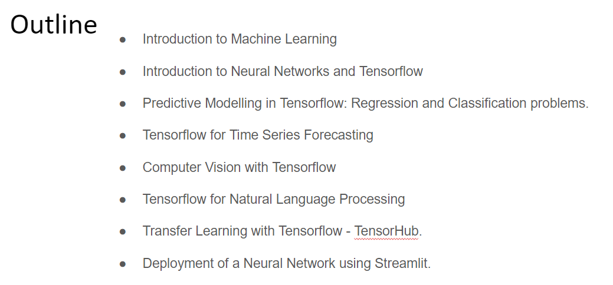

<<<<<<< HEAD
# 🧠 TensorFlow Course — IFOA Bologna

> **Hands-on deep learning with TensorFlow, from first neurons to production-ready models.**  
> Taught at [IFOA Bologna](https://www.ifoa.it/) by [Alket Cecaj](https://github.com/alketcecaj12).

---

## 🔬 The Scientific Method, Applied to Machine Learning

Every notebook in this course follows the same rigorous loop:

| Step | What We Do |
|------|-----------|
| **1. Observe** | Explore the dataset — distributions, missing values, patterns |
| **2. Hypothesize** | Decide what kind of model fits the problem (regression? classification? sequence?) |
| **3. Experiment** | Build and train the neural network in TensorFlow / Keras |
| **4. Analyze** | Evaluate with metrics — loss curves, accuracy, confusion matrices |
| **5. Conclude** | Interpret results, tune, and generalize |

This isn't just a coding course. It's training your brain to *think* like a data scientist.

---

## 📚 Course Modules

### 🔢 Regression — Predicting Continuous Values

| Notebook | Dataset | Key Concepts |
|----------|---------|--------------|
| `Regression_Tensorflow_beginners.ipynb` | Custom | Your first neural network |
| `Regression_Salary.ipynb` | Salary data | Simple linear regression with Keras |
| `Regression_ExamScore.ipynb` | Exam scores | Feature engineering basics |
| `Regression_UmbrellaSales.ipynb` | Vendite ombrelli 🌂 | Seasonal patterns |
| `Regression_Avertising.ipynb` | Advertising | Multi-feature regression |
| `Regression_SimpleRealEstate.ipynb` / `2` | Real estate | Model comparison |
| `Regression_BostonHousing.ipynb` | Boston Housing | Classic benchmark |
| `Regression_BostonHousing_CrossValidation.ipynb` | Boston Housing | k-fold cross-validation |

---

### 🎯 Classification — Predicting Categories

| Notebook | Dataset | Key Concepts |
|----------|---------|--------------|
| `Classification_1.ipynb` | Tabular | Binary classification basics |
| `Classification_Iris.ipynb` | Iris 🌸 | Multi-class, softmax |
| `Classification_PimaIndians.ipynb` | Pima Indians Diabetes | Medical data, threshold tuning |
| `Classification_PimaIndians_Evaluation.ipynb` | Pima Indians | Precision, recall, F1 |
| `Classification_Churn_1.ipynb` | Customer churn | Business classification |
| `Classification_Spam_1.ipynb` | Spam emails | Text as features |
| `ClassificationSonar.ipynb` | Sonar rocks vs mines | Signal classification |
| `LinearClassifiers/` | Various | Linear models as baselines |

---

### 🖼️ Computer Vision — Teaching Machines to See

| Notebook | Dataset | Key Concepts |
|----------|---------|--------------|
| `ImageProcessing_101.ipynb` | Custom images | Pixel arrays, filters |
| `Classification_MNIST.ipynb` | MNIST digits ✍️ | CNNs, pooling, flattening |
| `Classification_BorderCollies_VS_Labradors.ipynb` | Dogs 🐕 | Binary image classification |
| `Classification_Collies_VS_Labradors_SimpleModel.ipynb` | Dogs 🐕 | Simplified CNN |
| `Classification_MaskNoCorrMask.ipynb` | Mask/No mask 😷 | Real-world CV use case |
| `VGG16.ipynb` | Custom | Transfer learning with VGG16 |
| `ClassificatoreBC_Lab.ipynb` | Border Collies & Labs | Full pipeline lab |

---

### 📈 Time Series — Forecasting the Future

| Notebook | Method | Key Concepts |
|----------|--------|--------------|
| `TimeSeriesForecasting_MLP.ipynb` | MLP | Windowing, sequence inputs |
| `TimeSeriesForecasting_CNN.ipynb` | 1D CNN | Local pattern extraction |
| `TimeseresForecasting_LSTM.ipynb` | LSTM | Memory, vanishing gradients |

---

### 💬 Natural Language Processing

| Notebook | Task | Key Concepts |
|----------|------|--------------|
| `NLP_TextEncoding.ipynb` | Encoding | Tokenization, padding |
| `NLP_WordEmbeddingsForSentimentAnalysis.ipynb` | Sentiment | Word embeddings |
| `NLP_SarcasmDetection.ipynb` | Sarcasm 😏 | Real news headlines dataset |
| `NLP_TextClassification_TensorHub.ipynb` | Classification | Pretrained TF Hub embeddings |

---

### 🤖 Transformers — The Architecture Behind Modern AI

| Notebook | Task |
|----------|------|
| `Classification_with_Transformers.ipynb` | Text classification |
| `AnswerAQuestionWith_Transformers.ipynb` | Question answering |
| `SentimentAnalysisUsingTransformers.ipynb` | Sentiment |
| `NamedEntityRecognitionUsingTransformers.ipynb` | NER |
| `TextSummarization_Transformers.ipynb` | Summarization |
| `TextTranslation_Transformers.ipynb` | Translation |
| `Fill_Missing_Text_Transformers.ipynb` | Masked language modeling |

---

### 🚀 Deployment

| Notebook | Topic |
|----------|-------|
| `TF-Serving-completed.ipynb` | Serving models with TensorFlow Serving |
| `streamlitTest.py` | Interactive app demo with Streamlit |

---

## 🛠️ Setup & Requirements

```bash
# Create a virtual environment
python -m venv venv
source venv/bin/activate  # Windows: venv\Scripts\activate

# Install core dependencies
pip install tensorflow keras numpy pandas matplotlib scikit-learn
pip install transformers tensorflow-hub streamlit

# Launch Jupyter
jupyter notebook
```

**Python 3.8–3.11** recommended. TensorFlow 2.x required.

---

## 📂 Repository Structure

```
TensorflowCourse/
│
├── Regression_*.ipynb              # Regression problems
├── Classification_*.ipynb          # Classification problems
├── NLP_*.ipynb                     # NLP with Keras
├── *Transformers*.ipynb            # Transformer-based models
├── TimeSeriesForecasting_*.ipynb   # Forecasting
├── VGG16.ipynb                     # Transfer learning
├── TF-Serving-completed.ipynb      # Model deployment
│
├── dati/                           # Italian datasets
├── labrador-bordercollie/          # Dog image dataset
├── mask-or-nomask/                 # Mask detection images
├── modello/ & models/              # Saved model weights
├── LinearClassifiers/              # Linear classifier exercises
│
└── TensorflowSlides.pdf            # Course slides
```

---

## 🎓 About This Course

This course was developed and delivered at **IFOA Bologna**, one of Italy's leading professional training institutions. It is designed for practitioners who want to move beyond theory and build real deep learning solutions using TensorFlow and Keras.

The curriculum spans the full arc of modern deep learning — from a single neuron predicting salaries, to transformer architectures answering questions in natural language.

**Instructor:** Alket Cecaj — PhD, Data Scientist & AI Engineer with 12+ years of experience in machine learning, neural networks, and applied AI systems.

---

## 📜 License

This repository is shared for educational purposes. Feel free to use, fork, and learn from it. Attribution appreciated. 🙏

---

*"The best way to learn deep learning is to build something that would have seemed like magic five years ago."*
=======
#### Course about implementing neural networks in Tensorflow for solving different regression and classification problems 

- Here are the topics that the course covers. 


>>>>>>> 8b81b3b10a03381ccf1a7270968bc77b366caea4
